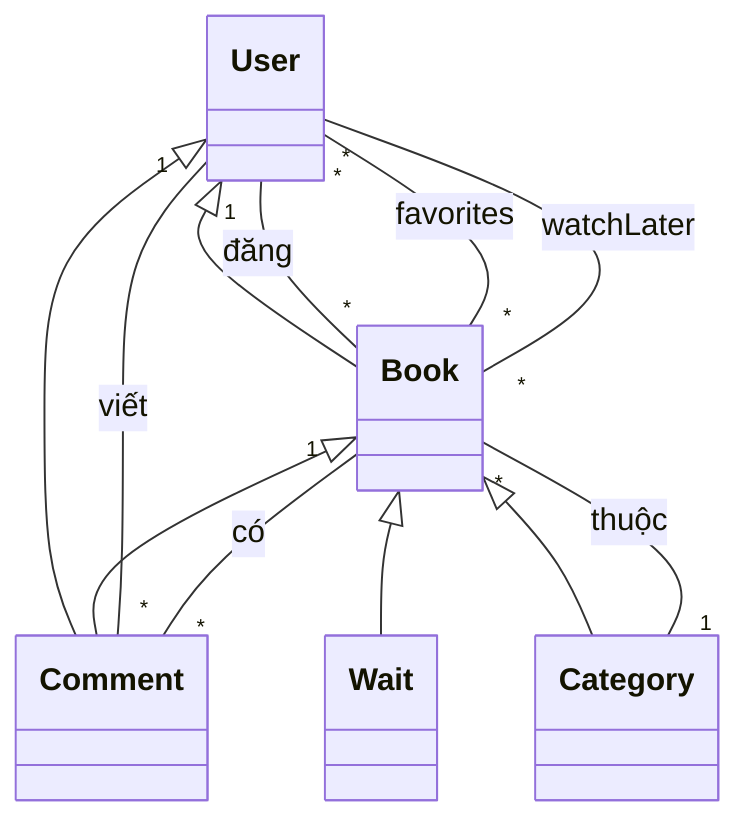
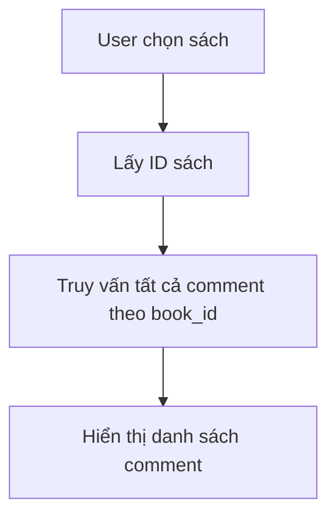
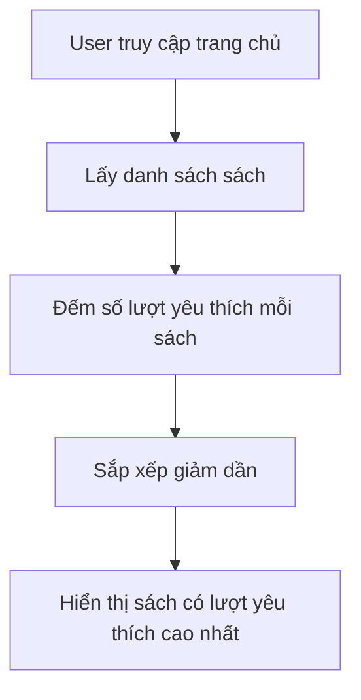

# BookReview_SharingPlatform

**Họ tên sinh viên:** Trần Văn Bun  
**Mã sinh viên:** 23010370  
**Lớp:** K17_CNTT-4  
**Môn học:** Web nâng cao (TH4)  

---

## 1. Giới thiệu Project

**BookReview_SharingPlatform** là một nền tảng chia sẻ và đánh giá sách trực tuyến. Ứng dụng cho phép người dùng:
- Đăng ký/đăng nhập tài khoản.
- Đăng tải sách.
- Bình luận, trả lời bình luận.
- Yêu thích và lưu sách để đọc sau.
- Quản lý sách chờ duyệt (chỉ Admin).
- Xem sách theo thể loại, sách nổi bật, sách mới.

Ứng dụng được xây dựng bằng **Laravel** kết hợp **Blade Template**, **Bootstrap**, và sử dụng **MySQL** để lưu trữ dữ liệu.

---

## 2. Các đối tượng chính trong hệ thống

| Đối tượng     | Mô tả                                                                 |
|---------------|-----------------------------------------------------------------------|
| **User**      | Người dùng hệ thống, có thể đăng ký, đăng nhập, bình luận, yêu thích.|
| **Book**      | Sách đã được duyệt, hiển thị công khai cho mọi người.               |
| **Wait**      | Sách do người dùng đăng, chờ admin kiểm duyệt.                       |
| **Comment**   | Bình luận và trả lời bình luận cho sách.                            |
| **Category**  | Thể loại sách.                                                       |
| **Contact**   | Form liên hệ/phản hồi người dùng gửi đến quản trị viên.             |

---

## 3. Sơ đồ lớp (Class Diagram)



---

## 4. Sơ đồ hoạt động (Activity Diagram)

### 4.1. Hiển thị tất cả bình luận của một cuốn sách



### 4.2. Tìm kiếm sách được yêu thích nhiều nhất



---

## 5. Chức năng chính (Ảnh chụp màn hình)

> *(Lưu ý: bạn nên chèn ảnh minh họa từ giao diện thật vào file PDF hoặc Word nộp)*

- Giao diện đăng ký / đăng nhập.
- Đăng sách mới.
- Trang duyệt sách (Admin).
- Giao diện bình luận / trả lời bình luận.
- Danh sách sách yêu thích / xem sau.
- Trang chủ: hiển thị sách nổi bật, sách mới đăng.

---

## 6. Code minh họa các phần chính

### 6.1. Model Book

```php
// File: app/Models/Book.php
namespace App\Models;

use Illuminate\Database\Eloquent\Model;

class Book extends Model
{
    protected $table = 'books';
    protected $fillable = [
        'id_user',
        'title',
        'author',
        'description',
        'cover_img',
        'link',
        'genre_id',
        'views',
        'favorites'
    ];

    public function genre()
    {
        return $this->belongsTo(Category::class, 'genre_id');
    }

    public function comments()
    {
        return $this->hasMany(Comment::class);
    }
}
```

### 6.2. Model Comment
### 6.3. Controller: BookController (store)

```php
// File: app/Http/Controllers/BookController.php

public function store(Request $request)
{
    $validated = $request->validate([
        'title' => 'required|string',
        'author' => 'required|string',
        'description' => 'required|string',
        'cover_img' => 'nullable|image|mimes:jpeg,png,jpg,gif,svg|max:2048',
        'link' => 'nullable|file|mimes:pdf,doc,docx|max:102400',
        'genre_id' => 'required|exists:categories,id',
    ]);

    $existsInWaiting = Wait::where('title', $validated['title'])
        ->where('author', $validated['author'])
        ->exists();

    $existsInBooks = Book::where('title', $validated['title'])
        ->where('author', $validated['author'])
        ->exists();

    if ($existsInWaiting || $existsInBooks) {
        return redirect()->back()->withErrors([
            'duplicate' => 'Tác phẩm với tên và tác giả này đã tồn tại trong hệ thống hoặc đang chờ duyệt.'
        ])->withInput();
    }

    if ($request->hasFile('cover_img')) {
        $coverPath = $request->file('cover_img')->store('covers', 'public');
        $validated['cover_img'] = $coverPath;
    }

    if ($request->hasFile('link')) {
        $filePath = $request->file('link')->store('attachments', 'public');
        $validated['link'] = $filePath;
    }

    $validated['id_user'] = Auth::id();

    Wait::create($validated);

    return redirect()->back()->with('success', 'Đã thêm đối tượng thành công!');
}
```


```php
// File: app/Models/Comment.php
namespace App\Models;

use Illuminate\Database\Eloquent\Model;

class Comment extends Model
{
    protected $fillable = ['user_id', 'book_id', 'parent_id', 'content'];

    public function user()
    {
        return $this->belongsTo(User::class);
    }

    public function book()
    {
        return $this->belongsTo(Book::class);
    }

    public function replies()
    {
        return $this->hasMany(Comment::class, 'parent_id');
    }
}
```
### 6.4. Controller: CommentController (store & reply)

```php
// File: app/Http/Controllers/CommentController.php

public function store(Request $request)
{
    $request->validate([
        'content' => 'required|string|max:1000',
    ]);

    Comment::create([
        'user_id' => Auth::id(),
        'book_id' => $request->book_id,
        'content' => $request->content,
    ]);

    return back()->with('success', 'Đã gửi bình luận.');
}

public function reply(Request $request)
{
    $request->validate([
        'content' => 'required|string|max:1000',
        'parent_id' => 'required|exists:comments,id',
    ]);

    Comment::create([
        'user_id' => Auth::id(),
        'book_id' => $request->book_id,
        'parent_id' => $request->parent_id,
        'content' => $request->content,
    ]);

    return back()->with('success', 'Đã gửi trả lời.');
}
```
## 7. Công nghệ sử dụng

| Công nghệ       | Mô tả                          |
|----------------|---------------------------------|
| **Laravel 10** | Backend PHP Framework chính.   |
| **Blade**      | Template engine dùng hiển thị. |
| **Bootstrap 5**| Giao diện responsive.           |
| **MySQL**      | Cơ sở dữ liệu quan hệ.         |
| **jQuery/AJAX**| Tải động bình luận, yêu thích. |
---

## 8. Kết luận

Dự án **BookReview_SharingPlatform** là một ứng dụng thực tế giúp người dùng yêu thích sách có thể chia sẻ, khám phá, và tương tác với nhau. Qua dự án này, em đã rèn luyện được các kỹ năng:
- Sử dụng Laravel để phát triển ứng dụng web.
- Làm việc với cơ sở dữ liệu quan hệ.
- Xử lý logic xác thực, phân quyền, và tương tác người dùng.
- Triển khai hệ thống bình luận đa cấp và thống kê dữ liệu (yêu thích, lượt xem).
- ---
