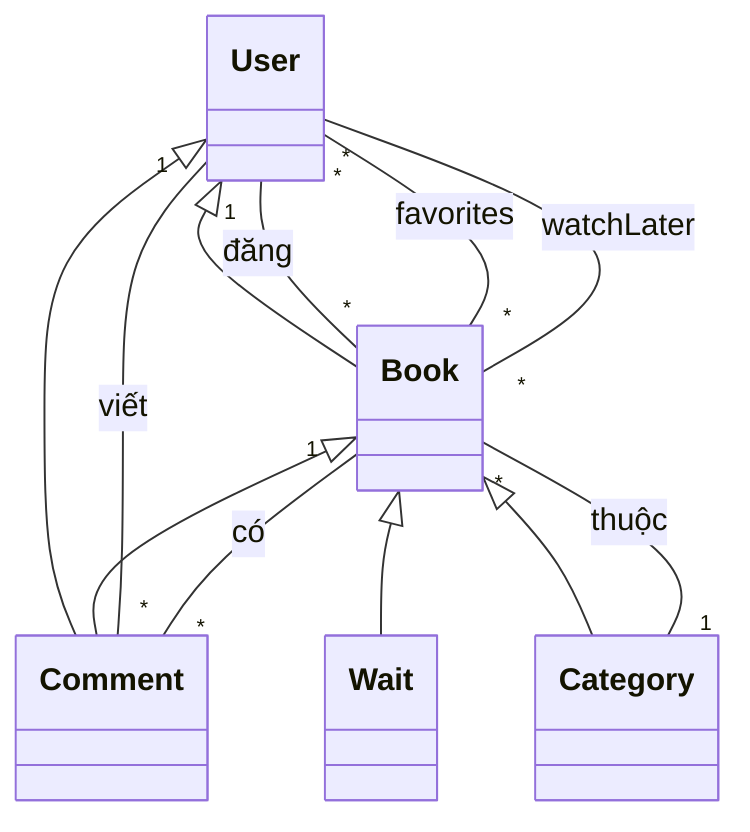
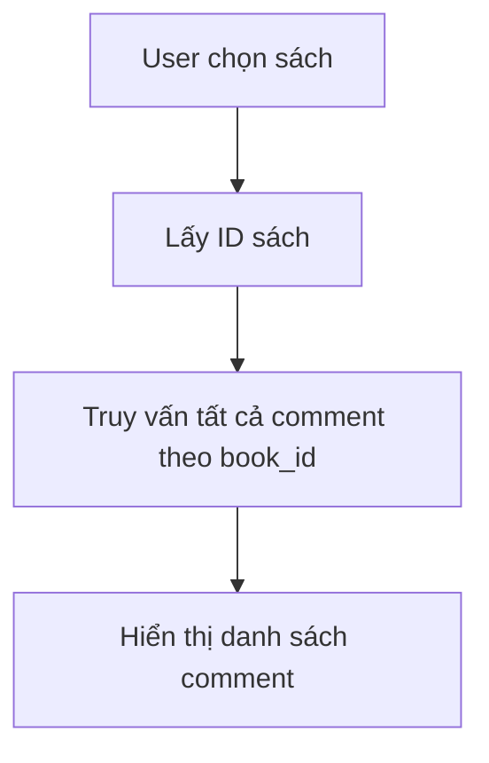
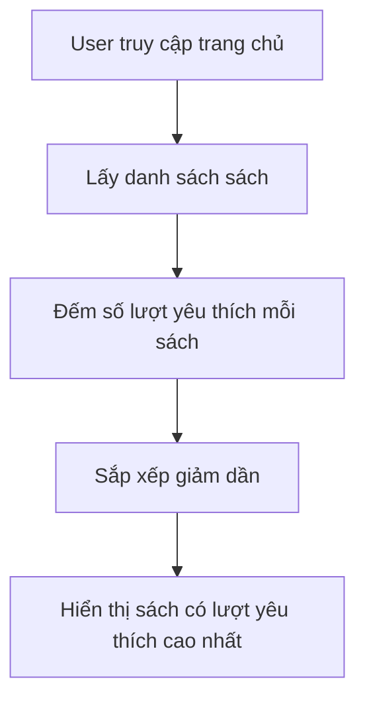

# BookReview_SharingPlatform

**Họ tên sinh viên:** [Trần Văn Bun]  
**Mã sinh viên:** [23010370]
**Lớp: K17_CNTT-4
**Môn học: Web nâng cao (TH4)
---

## Giới thiệu Project

BookReview_SharingPlatform là ứng dụng web cho phép người dùng đăng tải, chia sẻ, bình luận và đánh giá sách. Ứng dụng hỗ trợ xác thực, phân quyền, quản lý sách, quản lý người dùng, bình luận và trả lời bình luận.

---

## Đối tượng chính trong hệ thống

- **User:** Người dùng đăng ký, đăng nhập, đăng bài, bình luận, yêu thích, xem sau.
- **Book:** Sách đã được duyệt, hiển thị trên hệ thống.
- **Wait:** Sách chờ duyệt (người dùng gửi lên, admin duyệt mới thành sách chính thức).
- **Comment:** Bình luận và trả lời bình luận cho sách.
- **Category:** Thể loại sách.
- **Contact:** Liên hệ/phản hồi từ người dùng.

---

## Sơ đồ cấu trúc (Class Diagram)



---

## Sơ đồ thuật toán (Activity Diagram)

### Hiển thị tất cả bình luận của một cuốn sách



### Tìm kiếm sách được yêu thích nhiều nhất



---

## Ảnh chụp màn hình chức năng chính

- Đăng nhập/Đăng ký
- Đăng sách mới
- Duyệt sách chờ phê duyệt (admin)
- Bình luận, trả lời bình luận
- Yêu thích/Xem sau sách
- Trang chủ: Sách nổi bật, sách mới đăng

*(Chèn ảnh chụp màn hình vào đây)*

---

## Code minh họa phần chính project

### Model: Book

````php
// filepath: [Book.php](http://_vscodecontentref_/0)
namespace App\Models;

use Illuminate\Database\Eloquent\Model;

class Book extends Model
{
    protected $table = 'books';
    protected $fillable = [
        'id_user',
        'title',
        'author',
        'description',
        'cover_img',
        'link',
        'genre_id',
        'views',
        'favorites'
    ];
    public function genre()
    {
        return $this->belongsTo(Category::class, 'genre_id');
    }
    public function comments()
    {
        return $this->hasMany(Comment::class);
    }
}
### Model: Comment
<?php
// filepath: [Comment.php](http://_vscodecontentref_/1)
namespace App\Models;

use Illuminate\Database\Eloquent\Model;

class Comment extends Model
{
    protected $fillable = ['user_id', 'book_id', 'parent_id', 'content'];

    public function user()
    {
        return $this->belongsTo(User::class);
    }

    public function book()
    {
        return $this->belongsTo(Book::class);
    }

    public function replies()
    {
        return $this->hasMany(Comment::class, 'parent_id');
    }
}

