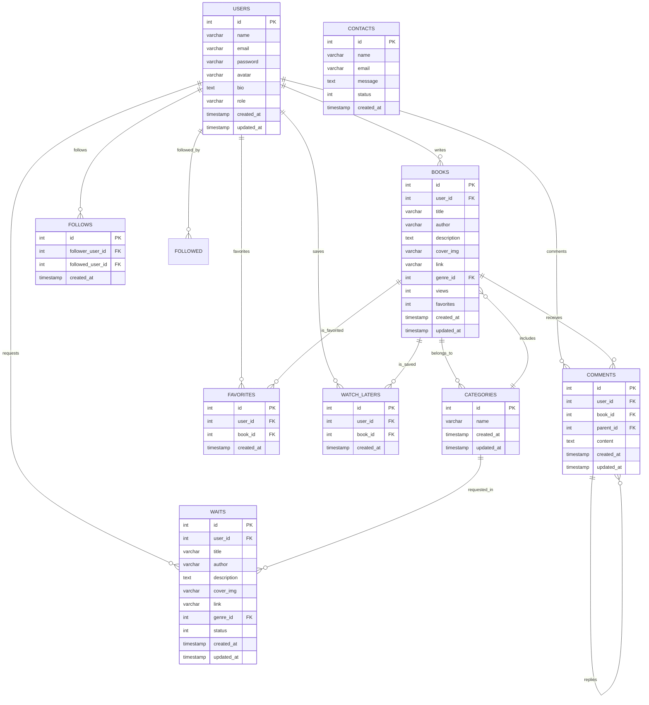

# BookReview_SharingPlatform

**Họ tên sinh viên:** Trần Văn Bun  
**Mã sinh viên:** 23010370  
**Lớp:** K17_CNTT-4  
**Môn học:** Web nâng cao (TH4)  

---

## 1. Giới thiệu Project

**BookReview_SharingPlatform** là một nền tảng chia sẻ và đánh giá sách trực tuyến. Ứng dụng cho phép người dùng:
- Đăng ký/đăng nhập tài khoản.
- Đăng tải sách.
- Bình luận, trả lời bình luận.
- Yêu thích và lưu sách để đọc sau.
- Quản lý sách chờ duyệt (chỉ Admin).
- Xem sách theo thể loại, sách nổi bật, sách mới.

Ứng dụng được xây dựng bằng **Laravel** kết hợp **Blade Template**, **Bootstrap**, và sử dụng **MySQL** để lưu trữ dữ liệu.

---

## 2. Các đối tượng chính trong hệ thống

| Đối tượng     | Mô tả                                                                 |
|---------------|-----------------------------------------------------------------------|
| **User**      | Người dùng hệ thống, có thể đăng ký, đăng nhập, bình luận, yêu thích.|
| **Book**      | Sách đã được duyệt, hiển thị công khai cho mọi người.               |
| **Wait**      | Sách do người dùng đăng, chờ admin kiểm duyệt.                       |
| **Comment**   | Bình luận và trả lời bình luận cho sách.                            |
| **Category**  | Thể loại sách.                                                       |
| **Contact**   | Form liên hệ/phản hồi người dùng gửi đến quản trị viên.             |

---
## 3.1 Sơ đồ khối



## 3. Sơ đồ lớp (Class Diagram)

```mermaid
classDiagram
    User "1" -- "*" Book : đăng
    User "1" -- "*" Comment : viết
    Book "1" -- "*" Comment : có
    Book "*" -- "1" Category : thuộc
    Book <|-- Wait
    User "*" -- "*" Book : favorites
    User "*" -- "*" Book : watchLater

    class User {
        id
        name
        email
        password
        avatar
        bio
        role
        // ...
    }
    class Book {
        id
        id_user
        title
        author
        description
        cover_img
        link
        genre_id
        views
        favorites
        // ...
    }
    class Wait {
        id
        id_user
        title
        author
        description
        cover_img
        link
        genre_id
        status
        // ...
    }
    class Comment {
        id
        user_id
        book_id
        parent_id
        content
        // ...
    }
    class Category {
        id
        name
        // ...
    }
```



---

## 4. Sơ đồ hoạt động (Activity Diagram)

### 4.1. Hiển thị tất cả bình luận của một cuốn sách

```mermaid
flowchart TD
    A[User chọn sách] --> B[Lấy ID sách]
    B --> C[Truy vấn tất cả comment theo book_id]
    C --> D[Hiển thị danh sách comment]
```



### 4.2. Tìm kiếm sách được yêu thích nhiều nhất

```mermaid
flowchart TD
    A[User truy cập trang chủ] --> B[Lấy danh sách sách]
    B --> C[Đếm số lượt yêu thích mỗi sách]
    C --> D[Sắp xếp giảm dần]
    D --> E[Hiển thị sách có lượt yêu thích cao nhất]
```


### 4.3. Đăng sách mới (User gửi bài chờ duyệt)

```mermaid
sequenceDiagram
    participant User
    participant Browser
    participant BookController
    participant WaitModel
    User->>Browser: Nhập thông tin sách, nhấn "Lưu"
    Browser->>BookController: POST /books/store (dữ liệu sách)
    BookController->>WaitModel: Kiểm tra trùng lặp
    alt Không trùng lặp
        BookController->>WaitModel: Tạo bản ghi sách chờ duyệt
        WaitModel-->>BookController: Trả về kết quả
        BookController->>Browser: Redirect + thông báo thành công
    else Trùng lặp
        BookController->>Browser: Redirect + thông báo lỗi
    end
```

### 4.4. Admin phê duyệt sách

```mermaid
sequenceDiagram
    participant Admin
    participant Browser
    participant AdminController
    participant WaitModel
    participant BookModel
    Admin->>Browser: Nhấn "Phê duyệt" sách
    Browser->>AdminController: PUT /books/{id}/approve
    AdminController->>WaitModel: Lấy thông tin sách chờ duyệt
    AdminController->>BookModel: Tạo bản ghi sách chính thức
    AdminController->>WaitModel: Xóa bản ghi chờ duyệt
    AdminController->>Browser: Redirect + thông báo thành công
```

### 4.5. Bình luận sách

```mermaid
sequenceDiagram
    participant User
    participant Browser
    participant CommentController
    participant CommentModel
    User->>Browser: Nhập bình luận, nhấn "Gửi"
    Browser->>CommentController: POST /comments/store
    CommentController->>CommentModel: Tạo bản ghi bình luận
    CommentModel-->>CommentController: Trả về kết quả
    CommentController->>Browser: Redirect + thông báo thành công
```

### 4.6.  Yêu thích/Xem sau sách

```mermaid
sequenceDiagram
    participant User
    participant Browser
    participant BookController
    participant UserModel
    participant BookModel
    User->>Browser: Nhấn nút "Yêu thích" hoặc "Xem sau"
    Browser->>BookController: POST /books/{id}/favorite hoặc /watchlater
    BookController->>UserModel: Kiểm tra trạng thái hiện tại
    alt Đã yêu thích/xem sau
        BookController->>UserModel: Bỏ liên kết
        BookController->>BookModel: Giảm lượt yêu thích (nếu là favorite)
    else Chưa yêu thích/xem sau
        BookController->>UserModel: Thêm liên kết
        BookController->>BookModel: Tăng lượt yêu thích (nếu là favorite)
    end
    BookController->>Browser: Trả về trạng thái mới (JSON)
```

---

## 5. Chức năng chính (Ảnh chụp màn hình)

- Giao diện đăng ký / đăng nhập.
- Đăng sách mới.
- Trang duyệt sách (Admin).
- Giao diện bình luận / trả lời bình luận.
- Danh sách sách yêu thích / xem sau.
- Trang chủ: hiển thị sách nổi bật, sách mới đăng.

---

## 6. Code minh họa các phần chính

### 6.1. Model Book

```php
// File: app/Models/Book.php
namespace App\Models;

use Illuminate\Database\Eloquent\Model;

class Book extends Model
{
    protected $table = 'books';
    protected $fillable = [
        'id_user',
        'title',
        'author',
        'description',
        'cover_img',
        'link',
        'genre_id',
        'views',
        'favorites'
    ];

    public function genre()
    {
        return $this->belongsTo(Category::class, 'genre_id');
    }

    public function comments()
    {
        return $this->hasMany(Comment::class);
    }
}
```

### 6.2. Model Comment
```php
// File: app/Models/Comment.php
namespace App\Models;

use Illuminate\Database\Eloquent\Model;

class Comment extends Model
{
    protected $fillable = ['user_id', 'book_id', 'parent_id', 'content'];

    public function user()
    {
        return $this->belongsTo(User::class);
    }

    public function book()
    {
        return $this->belongsTo(Book::class);
    }

    public function replies()
    {
        return $this->hasMany(Comment::class, 'parent_id');
    }
}
```
### 6.3. Controller: BookController (store)

```php
// File: app/Http/Controllers/BookController.php

public function store(Request $request)
{
    $validated = $request->validate([
        'title' => 'required|string',
        'author' => 'required|string',
        'description' => 'required|string',
        'cover_img' => 'nullable|image|mimes:jpeg,png,jpg,gif,svg|max:2048',
        'link' => 'nullable|file|mimes:pdf,doc,docx|max:102400',
        'genre_id' => 'required|exists:categories,id',
    ]);

    $existsInWaiting = Wait::where('title', $validated['title'])
        ->where('author', $validated['author'])
        ->exists();

    $existsInBooks = Book::where('title', $validated['title'])
        ->where('author', $validated['author'])
        ->exists();

    if ($existsInWaiting || $existsInBooks) {
        return redirect()->back()->withErrors([
            'duplicate' => 'Tác phẩm với tên và tác giả này đã tồn tại trong hệ thống hoặc đang chờ duyệt.'
        ])->withInput();
    }

    if ($request->hasFile('cover_img')) {
        $coverPath = $request->file('cover_img')->store('covers', 'public');
        $validated['cover_img'] = $coverPath;
    }

    if ($request->hasFile('link')) {
        $filePath = $request->file('link')->store('attachments', 'public');
        $validated['link'] = $filePath;
    }

    $validated['id_user'] = Auth::id();

    Wait::create($validated);

    return redirect()->back()->with('success', 'Đã thêm đối tượng thành công!');
}
```
### 6.4. Controller: CommentController (store & reply)

```php
// File: app/Http/Controllers/CommentController.php

public function store(Request $request)
{
    $request->validate([
        'content' => 'required|string|max:1000',
    ]);

    Comment::create([
        'user_id' => Auth::id(),
        'book_id' => $request->book_id,
        'content' => $request->content,
    ]);

    return back()->with('success', 'Đã gửi bình luận.');
}

public function reply(Request $request)
{
    $request->validate([
        'content' => 'required|string|max:1000',
        'parent_id' => 'required|exists:comments,id',
    ]);

    Comment::create([
        'user_id' => Auth::id(),
        'book_id' => $request->book_id,
        'parent_id' => $request->parent_id,
        'content' => $request->content,
    ]);

    return back()->with('success', 'Đã gửi trả lời.');
}
```
### 6.5. Controller: AuthController
```php
// File: app/Http/Controllers/AuthController.php

public function showRegisterForm()
{
    return view('fe.register');
}

public function register(Request $request)
{
    $validatedData = $request->validate([
        'name'     => 'required|string|max:255',
        'email'    => 'required|email|unique:users,email',
        'password' => 'required|confirmed|min:6',
        'avatar'   => 'nullable|image|mimes:jpg,jpeg,png,gif|max:2048',
        'bio'      => 'nullable|string|max:1000',
    ], [
        'name.required'     => 'Vui lòng nhập họ tên.',
        'email.required'    => 'Vui lòng nhập email.',
        'email.email'       => 'Email không hợp lệ.',
        'email.unique'      => 'Email đã tồn tại.',
        'password.required' => 'Vui lòng nhập mật khẩu.',
        'password.confirmed' => 'Xác nhận mật khẩu không khớp.',
        'password.min'      => 'Mật khẩu phải có ít nhất :min ký tự.',
        'avatar.image'      => 'Tệp tải lên phải là hình ảnh.',
        'avatar.mimes'      => 'Ảnh phải có định dạng jpg, jpeg, png hoặc gif.',
        'avatar.max'        => 'Ảnh đại diện không được vượt quá 2MB.',
    ]);

    $avatarPath = null;
    if ($request->hasFile('avatar')) {
        $path = $request->file('avatar')->store('avatars', 'public');
        $avatarPath = '/storage/' . $path;
    }

    User::create([
        'name'     => $validatedData['name'],
        'email'    => $validatedData['email'],
        'password' => Hash::make($validatedData['password']),
        'avatar'   => $avatarPath,
        'bio'      => $validatedData['bio'] ?? null,
        'role'     => 'user',
    ]);

    return redirect()->back()->with('success', 'Đăng ký thành công!');
}

public function showLoginForm()
{
    return view('fe.login');
}

public function login(Request $request)
{
    $credentials = $request->only('email', 'password');

    $request->validate([
        'email'    => 'required|email',
        'password' => 'required'
    ]);

    if (Auth::attempt($credentials)) {
        $request->session()->regenerate();

        if (Auth::user()->role === 'admin') {
            return redirect()->intended('/admin/dashboard');
        }

        return redirect('/');
    }

    return back()->withErrors([
        'email' => 'Thông tin đăng nhập không chính xác.',
    ])->onlyInput('email');
}

public function update(Request $request, $id)
{
    $user = User::findOrFail($id);

    $data = $request->only(['name', 'email', 'phone', 'contact', 'address', 'bio']);

    if ($request->hasFile('avatar')) {
        $path = $request->file('avatar')->store('avatars', 'public');
        $data['avatar'] = '/storage/' . $path;
    }

    $user->update($data);

    return redirect()->back()->with('success', 'Cập nhật thành công!');
}

public function submit(Request $request)
{
    $request->validate([
        'name' => 'required|string|max:255',
        'email' => 'required|email',
        'message' => 'required|string',
    ]);
    Contact::create([
        'name' => $request->name,
        'email' => $request->email,
        'message' => $request->message,
    ]);

    return back()->with('success', 'Your message has been sent!');
}

public function logout(Request $request)
{
    Auth::logout();

    $request->session()->invalidate();
    $request->session()->regenerateToken();

    return redirect('/login');
}
```
### 6.6. Controller: AdminController
```php
// File: app/Http/Controllers/AdminController.php
 //hiển thị danh sách các bài viết chờ phê duyệt
    public function bookIndex()
    {
        // $bookItemsWaits = wait::with('user')->where('status', 0)->get();
        $bookItemsWaits = wait::all();
        return view('admin.bookManager', compact('bookItemsWaits'));
    }

    //hiển thị các user đã đăng kí
    public function index(Request $request)
    {
        $search = $request->input('search');

        $users = User::where('id', '!=', Auth::id())
            ->when($search, function ($query, $search) {
                $query->where('name', 'like', "%$search%")
                    ->orWhere('email', 'like', "%$search%");
            })
            ->get();

        return view('admin.userManager', compact('users', 'search'));
    }

    //cập nhật vai trò tài khoản
    public function updateRole(Request $request, $id)
    {
        $request->validate([
            'role' => 'required|in:user,admin',
        ]);
        $user = User::findOrFail($id);
        $user->role = $request->role;
        $user->save();

        return redirect()->route('users.index')->with('success', 'Cập nhật vai trò thành công!');
    }

    //lấy thông tin người dùng
    public function showUser($id)
    {
        $user = User::findOrFail($id);
    }

    //xóa user
    public function destroyUser($id)
    {
        $user = User::findOrFail($id);

        // Không cho xoá chính mình
        if (auth::id() === $user->id) {
            return redirect()->back()->with('error', 'Bạn không thể xoá chính mình.');
        }

        // Không cho xoá admin nếu cần
        if ($user->role === 'admin') {
            return redirect()->back()->with('error', 'Không thể xoá tài khoản admin.');
        }

        $user->delete();
        return redirect()->back()->with('success', 'Xoá người dùng thành công.');
    }

    //phê duyệt các bài viết
    // public function approve($id)
    // {
    //     // Lấy bài viết từ bảng waiting
    //     $waiting = wait::findOrFail($id);

    //     // Chuyển thông tin sang bảng books
    //     $book = new Book();
    //     $book->title = $waiting->title;
    //     $book->author = $waiting->author;
    //     $book->description = $waiting->description;
    //     $book->genre = $waiting->genre;
    //     $book->cover_img = $waiting->cover_img;
    //     $book->link = $waiting->link;
    //     $book->id_user = $waiting->id_user;
    //     $book->save();

    //     // Xoá bản ghi khỏi bảng waiting
    //     $waiting->delete();

    //     return redirect()->back()->with('success', 'Phê duyệt bài viết thành công.');
    // }
    public function approve($id)
    {
        // Lấy bài viết từ bảng waits
        $waiting = Wait::findOrFail($id);

        // Chuyển thông tin sang bảng books
        $book = new Book();
        $book->title = $waiting->title;
        $book->author = $waiting->author;
        $book->description = $waiting->description;
        $book->genre_id = $waiting->genre_id; // Sửa tên field
        $book->cover_img = $waiting->cover_img;
        $book->link = $waiting->link ?: null;;
        $book->id_user = $waiting->id_user;
        $book->save();

        // Xoá bản ghi khỏi bảng waits
        $waiting->delete();

        return redirect()->back()->with('success', 'Phê duyệt bài viết thành công.');
    }


    //thực hiện xóa xbài viết chờ phê duyệt
    public function destroyBook($id)
    {
        $book = wait::findOrFail($id);
        // Xóa ảnh bìa nếu tồn tại
        if ($book->cover_img && Storage::disk('public')->exists($book->cover_img)) {
            Storage::disk('public')->delete($book->cover_img);
        }

        // Xóa file đính kèm nếu tồn tại
        if ($book->link && Storage::disk('public')->exists($book->link)) {
            Storage::disk('public')->delete($book->link);
        }

        // Xóa bài
        $book->delete();

        return redirect()->back()->with('success', 'Đã gỡ bài thành công!');
    }

    //xem bài viết phản hồi
    public function indexContact()
    {
        $contacts = \App\Models\Contact::latest()->paginate(10);
        return view('admin.notification', compact('contacts'));
    }

    //đánh giấu đã đọc thư báo cáo
    public function markAsRead($id)
    {
        $contact = Contact::findOrfail($id);
        if ($contact->status === '0') {
            $contact->status = '1';
            $contact->save();
        }
        return redirect()->back()->with('success', 'Đã đánh dấu là đã đọc.');
    }

    //xóa notification
    public function deleteNotification($id)
    {
        $contact = Contact::findOrfail($id);
        $contact->delete();
        return redirect()->back()->with('success', 'Xoá thư thành công.');
    }

    //thực hiện thêm thông tin vào phần hiển thị thể loại sách
    public function showCategories()
    {
        $categories = Category::all();
        return view('admin.categori', compact('categories'));
    }

    //thêm thể loại sách vào bảng
    public function store(Request $request)
    {
        $request->validate([
            'name' => 'required|string',
        ]);

        Category::create([
            'name' => $request->name,
        ]);

        return redirect()->back()->with('success', 'Thêm thể loại thành công!');
    }
```
### 📄 Blade Template (View)

```
### 🌐Routes
```php
// File: routes/web.php

// ============ AUTH (Đăng nhập, Đăng ký, Đăng xuất) ============
Route::get('/login', [AuthController::class, 'showLoginForm'])->name('login');
Route::get('/register', [AuthController::class, 'showRegisterForm'])->name('register');
Route::post('/register', [AuthController::class, 'register']);
Route::post('/login', [AuthController::class, 'login']);
Route::post('/logout', [AuthController::class, 'logout'])->name('logout');

// ============ GIAO DIỆN NGƯỜI DÙNG ============
Route::middleware(['auth'])->group(function () {
    // Trang chủ
    Route::get('/', [BookController::class, 'featuredBooks'])->name('main');
    Route::get('/da', [BookController::class, 'featuredBooks'])->name('books.home');

    // Trang hồ sơ cá nhân
    Route::get('/profile', fn () => view('main.profile'))->name('profile');
    Route::get('/dashboard/profile', fn () => view('main.profile'))->name('profile');
    Route::put('/user/{id}', [AuthController::class, 'update'])->name('user.update');

    // Liên hệ / Góp ý
    Route::get('/dashboard/contact', fn () => view('main.contact'))->name('contactMe');
    Route::post('/contact', [AuthController::class, 'submit'])->name('contact.submit');

    // Bài viết cá nhân
    Route::get('/dashboard/mypost', fn () => view('main.mypost'))->name('myPost');
    Route::delete('/books/{id}', [BookController::class, 'destroy'])->name('booksUser.destroy');

    // Chi tiết sách
    Route::get('/readBook/{id}', [BookController::class, 'readBook'])->name('books.show');
    Route::get('/sameGenreBooks/{id}', [BookController::class, 'sameGenreBooks'])->name('sameGenreBooks');

    // Tương tác với sách
    Route::post('/books/{book}/favorite', [BookController::class, 'toggleFavorite']);
    Route::post('/books/{book}/watchlater', [BookController::class, 'toggleWatchLater']);

    // Bình luận
    Route::post('/comments', [CommentController::class, 'store'])->name('comments.store');
    Route::post('/comments/reply', [CommentController::class, 'reply'])->name('comments.reply');
});

// ============ ĐĂNG SÁCH MỚI ============
Route::get('/books', [BookController::class, 'index'])->name('books.index');
Route::post('/books', [BookController::class, 'store'])->name('books.store');

// ============ QUẢN TRỊ VIÊN ============
Route::middleware(['auth', 'admin:admin'])->group(function () {
    // Dashboard quản trị
    Route::get('/admin/dashboard', [AdminController::class, 'bookIndex'])->name('admin.dashboard');

    // Quản lý người dùng
    Route::get('/admin/userManager', [AdminController::class, 'index'])->name('users.index');
    Route::delete('/admin/userManager/{id}', [AdminController::class, 'destroyUser'])->name('users.destroy');
    Route::patch('/admin/users/{id}/role', [AdminController::class, 'updateRole'])->name('users.updateRole');

    // Phê duyệt và xóa bài viết
    Route::put('/admin/approve/{id}', [AdminController::class, 'approve'])->name('books.approve');
    Route::delete('/admin/dashboard/{id}', [AdminController::class, 'destroyBook'])->name('books.destroy');

    // Quản lý liên hệ
    Route::get('/admin/notification', [AdminController::class, 'indexContact'])->name('admin.notification');
    Route::post('/admin/notification/read/{id}', [AdminController::class, 'markAsRead'])->name('admin.contacts.markAsRead');
    Route::delete('/admin/notification/delete/{id}', [AdminController::class, 'deleteNotification'])->name('admin.contacts.destroy');

    // Quản lý thể loại
    Route::get('/admin/categori', [AdminController::class, 'showCategories'])->name('admin.categori');
    Route::post('/admin/addcategori', [AdminController::class, 'store'])->name('categories.store');
```
### 🔒 Bảo Mật
+CSRF Protection (Chống giả mạo yêu cầu liên trang)
Laravel tự động bảo vệ các form bằng CSRF token.
Tất cả các form đều sử dụng @csrf để đảm bảo chỉ nhận request hợp lệ.
+XSS Protection (Chống tấn công chèn mã độc)
Dữ liệu đầu ra được escape bằng cú pháp {{ $variable }} trong Blade.
Không render HTML trực tiếp từ dữ liệu người dùng.
+Phân quyền:
1. Xác thực người dùng
Laravel built-in authentication (Auth) được sử dụng để xác định danh tính người dùng.
Các route yêu cầu đăng nhập đều được bảo vệ bằng middleware auth.
```php
Route::middleware(['auth'])->group(function () {
    // Chỉ người dùng đã đăng nhập mới truy cập được các route này
});
```
2. Phân quyền theo vai trò (Admin/User)
Mỗi người dùng có trường role trong bảng users, mặc định là user.
Admin được xác định khi role === 'admin'.
```php
Route::middleware(['auth', 'admin:admin'])->group(function () {
    // Chỉ admin mới truy cập được
});
```
### 🖼️ Giao Diện Website
## 🔐 Trang Xác Thực
## Đăng ký

## Đăng nhập

### Giao diện người dùng
## Home

## Chỉnh sửa trang cá nhân 

## Danh sách bài đăng/chờ duyệt

## Thêm bài đăng

## Giao diện phần xem sách

### Giao diện Admin
## Phần duyệt bài đăng

## Quản lý người dùng

## Thêm thể loại

## Nhận phải hồi từ người dùng


## 7. Công nghệ sử dụng

| Công nghệ       | Mô tả                          |
|----------------|---------------------------------|
| **Laravel 10** | Backend PHP Framework chính.   |
| **Blade**      | Template engine dùng hiển thị. |
| **Bootstrap 5**| Giao diện responsive.           |
| **MySQL**      | Cơ sở dữ liệu quan hệ.         |
| **jQuery/AJAX**| Tải động bình luận, yêu thích. |
---

## 8. Kết luận

Dự án **BookReview_SharingPlatform** là một ứng dụng thực tế giúp người dùng yêu thích sách có thể chia sẻ, khám phá, và tương tác với nhau. Qua dự án này, em đã rèn luyện được các kỹ năng:
- Sử dụng Laravel để phát triển ứng dụng web.
- Làm việc với cơ sở dữ liệu quan hệ.
- Xử lý logic xác thực, phân quyền, và tương tác người dùng.
- Triển khai hệ thống bình luận đa cấp và thống kê dữ liệu (yêu thích, lượt xem).
- ---
